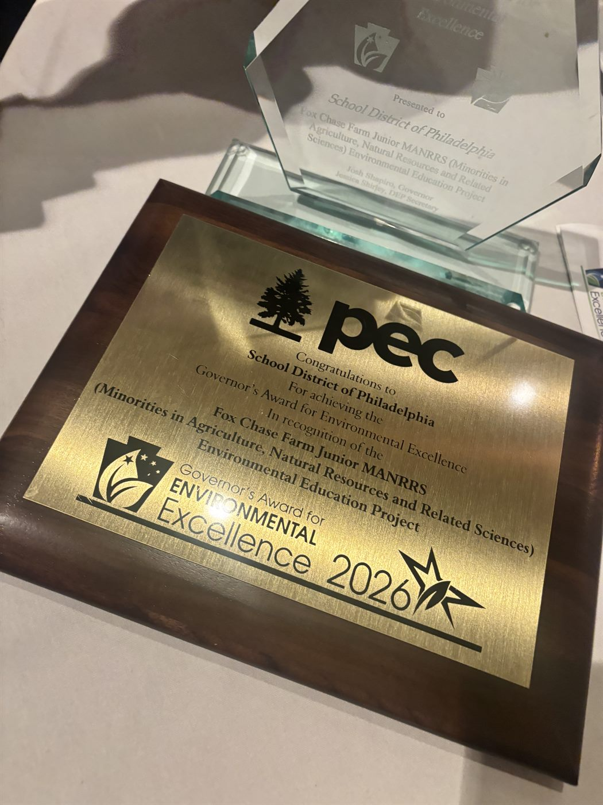
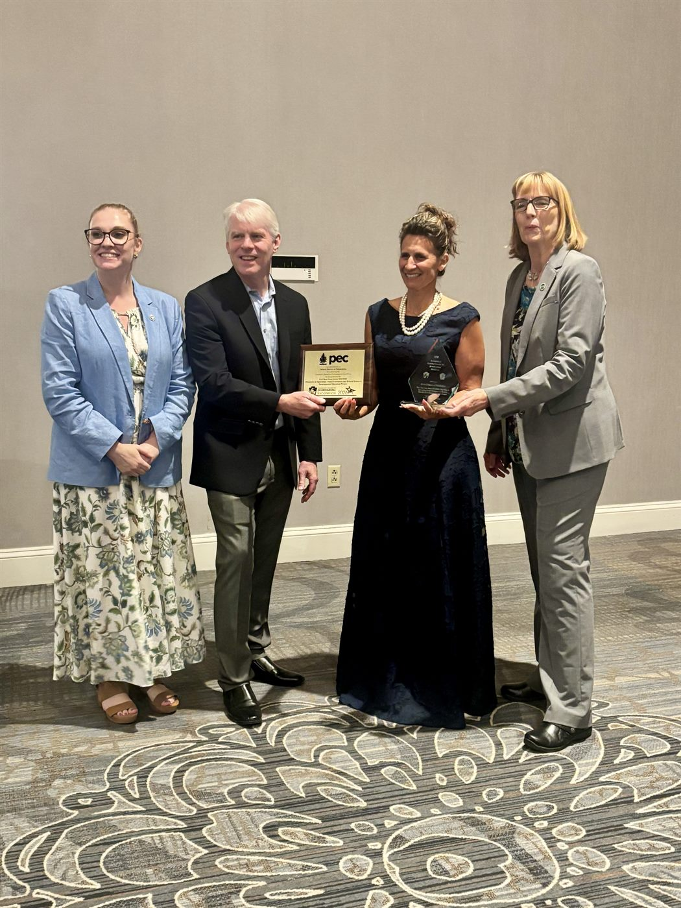
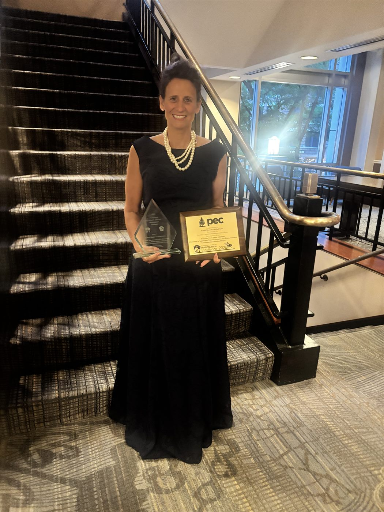

Fox Chase Farm was honored at the **2026 Governor's Awards for Environmental Excellence**, where Dr. Mandy Manna accepted the award on behalf of the School District of Philadelphia for the **Fox Chase Farm Junior MANRRS Environmental Education Project**.

The Junior MANRRS program — Minorities in Agriculture, Natural Resources, and Related Sciences — is an environmental leadership and workforce development initiative that expands opportunities for students in grades 7 through 12 to engage in hands-on learning focused on agriculture, sustainability, climate change, water stewardship, environmental justice, and green career pathways.

Through community gardening, composting, environmental advocacy, student-led educational programming, and partnerships with organizations such as the Philadelphia Water Department, students develop leadership skills while making a meaningful impact in their communities.

This award recognizes the program's commitment to empowering students from historically underserved communities to become the next generation of environmental leaders.

